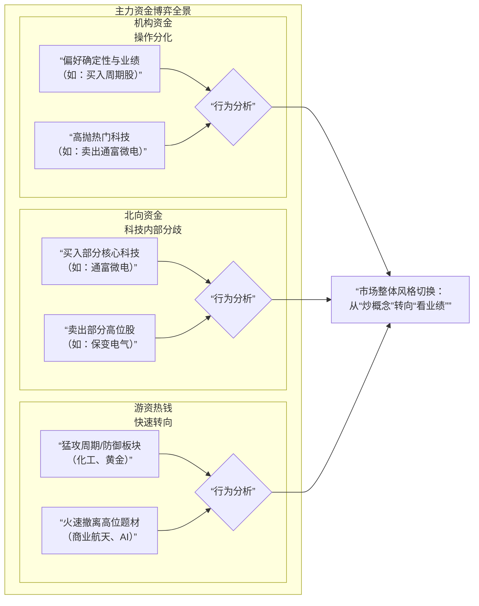

# 1.21 A股复盘：半导体涨停潮下的资金暗战，主力“高切低”路线图全揭秘

> 一边是半导体板块集体狂欢涨停，另一边是前期热门题材大幅跳水。今日A股市场在一场激烈的资金博弈中，悄然完成了关键的风格切换。

周二（1月21日），A股三大指数微幅收涨，但盘面分化剧烈。两市成交额显著缩量，显示出市场整体的谨慎态度。

在此背景下，主力资金的真实动向成为解码市场的关键。交易所盘后公布的龙虎榜数据，为我们提供了一份清晰的“资金作战地图”。

---

## 一、资金动向总览：各方势力博弈图

今日市场的多空博弈，清晰地体现在了各类资金的差异化选择上。下图直观展示了不同主力资金的买卖偏好和核心逻辑：

**核心冲突最激烈的战场，莫过于半导体龙头——通富微电。**

## 二、核心博弈点：一只股票，两种信仰

今日涨停的**通富微电**，其龙虎榜上演了一幕“冰与火之歌”，成为观察资金分歧的绝佳样本：

*   **多方主力：北向资金** - **深股通专用席位大举买入7.10亿元**，是推动涨停的核心力量之一。
*   **空方主力：内资机构** - **两家机构专用席位趁机合计净卖出1.25亿元**，果断执行获利了结。

**外资与内资机构的这种激烈对决**，生动刻画了当前市场对科技股的核心分歧：一方认为是趋势反转的起点，另一方则视为超跌反弹的卖点。这种博弈为后续科技股走势增添了不确定性。

与科技股内部“左右互搏”不同，另一个方向则汇聚了资金的共识。

## 三、共识避风港：黄金板块的“统一战线”

在不确定性的笼罩下，具备避险属性的贵金属板块成为今日罕见的资金“共识区”。例如**湖南白银**，其龙虎榜上同时出现了机构、北向和游资席位共同买入的身影。

这背后的核心逻辑是明确的**风险对冲需求**。在国际金价持续走强、宏观经济不确定性犹存的背景下，黄金股同时具备了防御性和资产价格联动的进攻性，从而吸引了各类风格资金的共同青睐。

**资金的“不约而同”与“各自为战”，清晰地勾勒出市场从追逐梦想转向拥抱确定性的风格切换。**

## 四、市场新主线：“高切低”风格切换确认

从高位题材股流出的资金，正在向两大方向集结，形成新的市场主线：

1.  **方向一：有业绩支撑的“硬科技”**。以半导体为代表的板块今日领涨，其驱动力不仅来自国产替代的长期逻辑，更与近期部分公司发布的亮眼业绩预告密切相关，验证了“基本面为王”的选股思路。
2.  **方向二：有价格支撑的资源周期股**。除了黄金，化工（如环氧丙烷）、部分有色金属板块也获得资金流入。这背后是对全球通胀预期、供给侧变化以及产品涨价逻辑的押注，反映了资金对宏观周期的重新审视。

这种“从高位向低位，从题材向业绩”的切换，是市场风险偏好下降、进入理性整固期的典型标志。

## 五、后市展望：缩量行情下的应对策略

今日市场最大的特征之一是**显著缩量**。两市成交额较前一交易日减少约1771亿元。**缩量反弹通常意味着上涨动力主要来自抛压减轻，而非新增资金的主动进攻**，这制约了指数的短期上行空间。

对于后续市场，我们可以从龙虎榜的线索中得到以下启示：

*   **结构性机会为主**：普涨行情难现，机会将集中在**业绩确定性高、产业逻辑清晰且估值合理的板块**。
*   **警惕高位题材补跌**：从商业航天到部分AI应用，今日龙虎榜显示游资撤离坚决，相关高位股风险尚未完全释放。
*   **关注“机构+”方向**：在震荡市中，那些能获得**机构与北向资金共振买入**的个股，往往具备更强的抗跌性和后续潜力，值得作为研究重点。

**春季行情或许尚未结束，但它的演绎方式正在从“大开大合”转变为“精耕细作”。**

---

今日的龙虎榜如同一面棱镜，折射出当前A股市场复杂的资金情绪光谱。乐观者看到科技反攻的曙光，悲观者担忧高位股的风险释放，而现实主义者则在周期与业绩中寻找避风港。

市场的下一阶段，将是梦想与财报、故事与数据的较量。对于投资者而言，在这个风格转换期，理解并跟踪主力的真实调仓路线，或许比预测指数点位更为重要。

> 龙虎榜数据揭示了机构卖出通富微电1.25亿元的同时，游资正在江天化学等周期股上开辟新战线。这种资金的悄然转向，或许正是市场变盘的前奏。