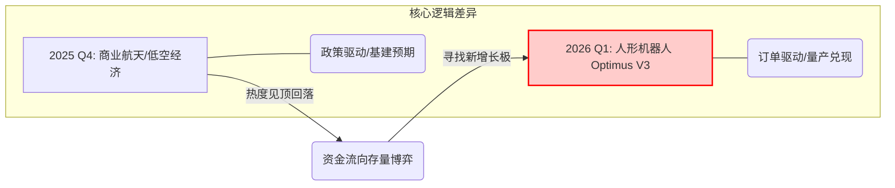
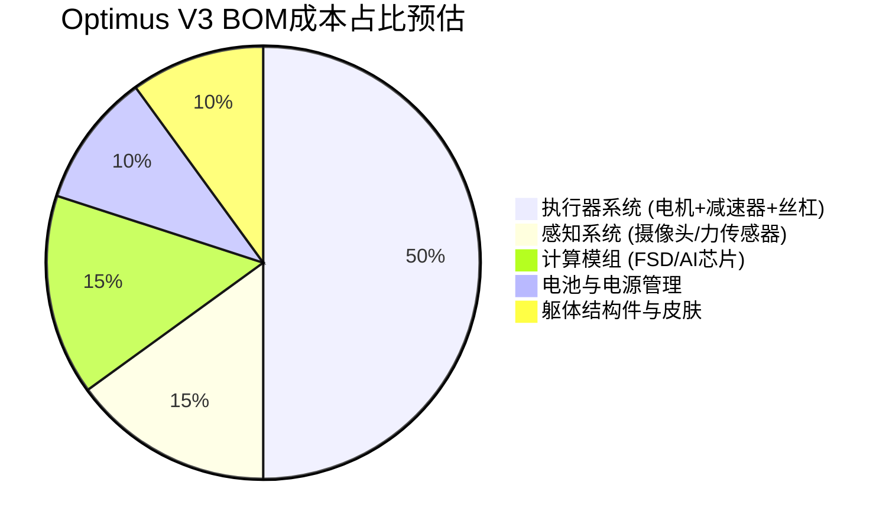
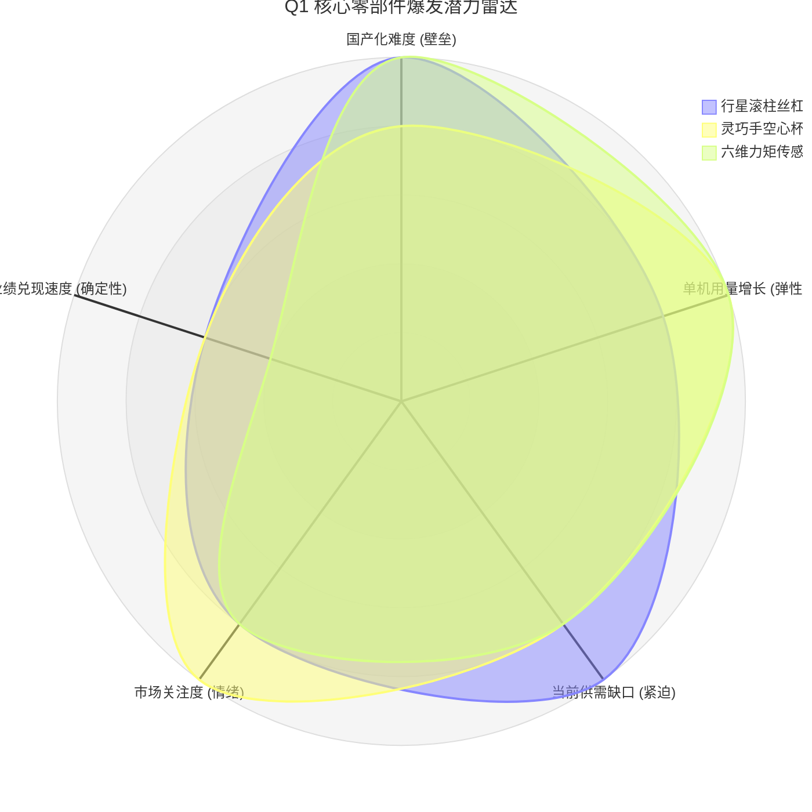

# 商业航天已“熄火”？人形机器人接棒：Optimus V3 发布前夜的投资生死时速

**【导语】**
2026年1月中旬，站在A股市场的十字路口，一场剧烈的风格切换正在发生。当商业航天的万亿故事因组网周期漫长而逐渐缺乏性感，资金正集体转向一个更确定、更庞大的赛道——**人形机器人量产前夜**。

Optimus V3 箭在弦上，这不再是概念炒作，而是一场关于“订单与业绩”的抢滩登陆战。

---

### 📊 图表一：A股硬科技主线切换示意图 (2025 Q4 - 2026 Q1)

*（注：此图示意资金热度与板块轮动趋势，黄色区域代表当前时间窗口）*

---

## 一、 临界点：Optimus V3 并非演习，而是“收割”的开始

市场之所以在2026年Q1集体转向，根本原因在于特斯拉 **Optimus V3（第三代）** 的技术状态已满足工业化门槛。这不再是实验室的大玩具，而是即将进厂打工的“劳动力”。

根据产业链最新交叉验证信息，V3相比前代实现了三大跨越：

1. **“灵巧手”革命（22自由度）**：手部动作精细度翻倍，使其能胜任90%以上的精密电子装配岗位。
2. **具身智能“大脑”落地**：深度集成 **Grok 3.0** 多模态大模型，实现完全自主决策，告别遥控时代。
3. **发布哨音已响**：马斯克暗示的 **2026年3月发布会**，不仅是展示样机，更是宣布百万台产能时间表的“发令枪”。

---

### 📅 图表二：2026年 Q1 人形机器人关键事件日历

*（注：这是当前市场博弈的时间轴核心）*

| 时间节点 | 关键事件 (Catalyst) | 市场预期与核心看点 | 紧迫指数 |
| --- | --- | --- | --- |
| **1月 中下旬** | **特斯拉/T链年报预告** | 验证供应链企业是否开始为机器人业务进行资本开支（建厂、买设备）。 | 🔥🔥🔥 |
| **2月 上旬** | **图纸冻结/定点确认** | V3设计方案最终确定，供应商名单不再变动。“小作文”高发期。 | 🔥🔥🔥🔥 |
| **2月 下旬** | **新剑传动等 IPO进展** | 纯正机器人标的上市进度，将极大提振板块估值情绪。 | 🔥🔥🔥 |
| **3月 中下旬** | **🚀 Optimus V3 发布会** | **决战时刻。** 展示真机实操能力，公布量产价格与时间表。 | 🔥🔥🔥🔥🔥 |

---

## 二、 深度对峙：T链双雄，谁是V3时代的“也是之王”？

在 Optimus V3 的硬件成本结构中，**执行器（关节）** 占据了半壁江山。这也使得 **三花智控** 与 **拓普集团** 成为了绕不开的绝对核心。

### 📊 图表三：Optimus V3 硬件成本结构拆解 (预估)

*（注：执行器是价值量最大、国产替代最确定的环节，直观展示了双雄的市场空间）*

### 1. 三花智控 (002050.SZ)：稳健派的“价值中枢”

* **核心卡位**：主攻**旋转执行器**集成。凭借全球龙头的热管理制造能力，其成本控制和规模化能力极强。
* **V3 看点**：单机价值量预计稳定在 3.5万-4.5万人民币。在2026 Q1，它是板块中业绩最扎实的“底仓”选择。

### 2. 拓普集团 (601689.SH)：激进派的“全能战士”

* **核心卡位**：从**直线执行器**到结构件全覆盖，响应速度业内第一。
* **V3 看点**：其自研的无框力矩电机若在V3中实现高比例配套，盈利弹性将显著高于纯组装商。

---

## 三、 伏击 Q1：寻找比大盘快十倍的“高弹性”赛道

如果要在Q1锁定超额收益，仅仅买入集成商是不够的，必须向产业链上游寻找最紧缺的“卡脖子”环节。

### 🎯 图表四：2026 Q1 高爆发细分赛道雷达图

*（注：越靠近外圈，代表该环节在Q1的爆发潜力和国产替代紧迫性越高）*

* **最强弹性——行星滚柱丝杠**：V3直线执行器的心脏。此前被欧洲垄断，2026年是国产丝杠进入T链验证的关键元年，一旦突破，空间巨大。
* **最大增量——灵巧手组件**：22自由度意味着**空心杯电机**和**微型传感器**的用量将指数级增长。

---

## 四、 结语：别在黎明前掉队

2026年的资本市场不相信眼泪，只相信订单。

当商业航天还在仰望星空等待下一个五年计划时，人形机器人已经踏在了工厂的地板上，准备接管流水线。这是一场从“科幻故事”到“工业革命”的接力。

此刻，距离 V3 发布会仅剩两个月窗口期。对于投资者而言，**盯紧核心供应链的资本开支动向，在分歧中完成布局，在发布会的高潮中保持清醒**，将是赢下 Q1 关键战役的不二法门。